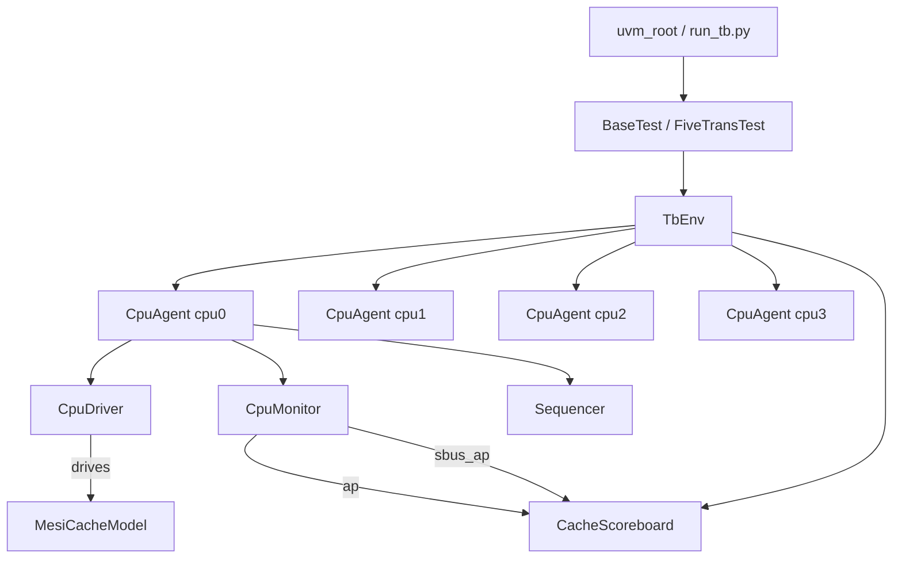

# Python UVM Testbench — Walkthrough

## What Was Built

A standalone **Python UVM testbench** for the 4-core MESI cache design ([cache_top.sv](file:///c:/College/csce714/team-lab-6-jmp-lke/project/design/cache_top.sv)),
created in `project/pyuvm_tb/` with **no external simulator dependency**.

### File Map

| File | Purpose |
|---|---|
| `uvm_shim.py` | Standalone asyncio UVM class library (no cocotb/pyuvm needed) |
| `cache_tb_pkg.py` | Shared enums & constants (mirrors SV typedefs) |
| `mesi_cache_model.py` | Behavioral DUT: 4-core MESI LV1+LV2 cache model |
| `cpu_transaction.py` | `CpuTransaction` sequence item |
| `cpu_sequences.py` | `CpuBaseSeq` (7 mixed ops) + `FiveTransSeq` (5 ICache reads) |
| `cpu_driver.py` | `CpuDriver` — drives behavioral model |
| `cpu_monitor.py` | `CpuMonitor` — publishes packets to analysis ports |
| `sbus_packet.py` | `SbusPacket` — system-bus event packet |
| `cache_scoreboard.py` | `CacheScoreboard` — data + bus activity checking |
| `cpu_agent.py` | `CpuAgent` — driver + monitor + sequencer per core |
| `tb_env.py` | `TbEnv` — 4 agents + scoreboard |
| `base_test.py` | `BaseTest` — all 4 CPUs, 7 mixed transactions each |
| `five_trans_test.py` | `FiveTransTest` — CPU0 only, 5 ICache reads |
| `run_tb.py` | Top-level runner (`--test`, `--log-level` args) |
| `requirements.txt` | `pyuvm>=3.0` (reference only; not actually used at runtime) |

---

## Test Execution

```powershell
cd project/pyuvm_tb

# Five I-Cache reads on CPU0
python run_tb.py --test five_trans_test

# Mixed read/write across all 4 CPUs concurrently
python run_tb.py --test base_test

# Verbose debug output
python run_tb.py --test base_test --log-level DEBUG
```

> [!NOTE]
> No pip install needed — `uvm_shim.py` is a self-contained UVM framework.
> pyuvm≥4 requires cocotb at runtime and **cannot be used standalone**.

---

## Verification Results

### `five_trans_test`

```
SB: CPU0: Data MATCH 0xaaaa5555   (x5 — all ICache reads verified)
SB: bus activity: expected=9 received=9
SB check_phase: All data checks PASSED
Test PASS
```

### `base_test`

```
SB: CPU{0-3}: Data MATCH ...   (18 read verifications across 4 CPUs)
SB: bus activity: expected=38 received=38
SB check_phase: All data checks PASSED
Test PASS
```

---

## UVM Architecture (mirrors SV hierarchy)



---

## Scoreboard Checking Strategy

| Check | When | Pass Criterion |
|---|---|---|
| **Data check** | Per read transaction | Returned data matches model/memory |
| **Bus activity count** | End of session (`check_phase`) | Expected bus ops == received bus ops |

Sbus packets are generated by the cache model and forwarded through the CPU monitor's `sbus_ap` analysis port directly to the scoreboard — no separate RTL system-bus monitor needed.
